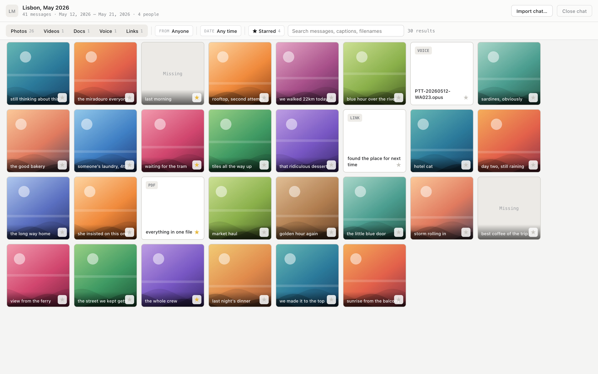
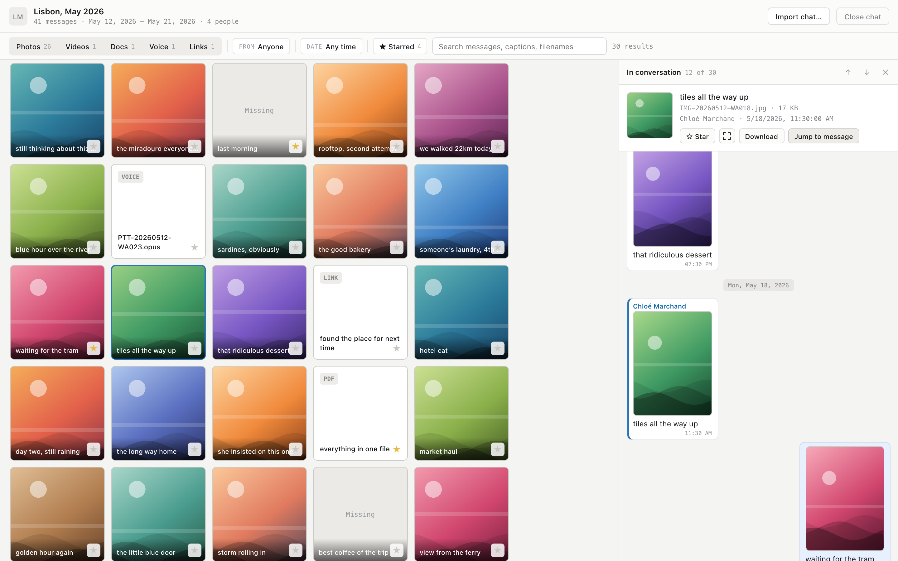

<div align="center">

# WhatsApp Media Reader

**A reader for an exported WhatsApp chat, inverted: the media is the index, the conversation is the detail view.**

You browse what was sent, and use any file as a way back into its moment in the thread.

[](https://github.com/MisterPandaPooh/whatsapp-media-reader/actions/workflows/ci.yml)
[](LICENSE)


**[Open the demo →](https://misterpandapooh.github.io/whatsapp-media-reader/)**

No export needed — there is a made-up chat waiting inside.

</div>



## The problem

Years of a group chat hold hundreds of photos, and there are only two ways to reach them, both bad.

WhatsApp's own media gallery gives you a wall of thumbnails with everything stripped away — who sent it, what was being said, why it was funny. And scrolling the thread gives you all of that context but no overview at all: to find one photo from a trip three years ago you scroll past ten thousand messages, on a phone, hoping to recognise it as it flies past.

Exporting is supposed to fix this. It doesn't. You get a `.zip` with a 40MB `_chat.txt` and a flat folder of four thousand files called `IMG-20240817-WA0031.jpg`, sorted by nothing you care about, with the conversation in a text file nobody will ever read.

This app takes that export and turns it into the thing you actually wanted: **every file as a browsable, filterable library, where any tile opens the conversation around it.** The media becomes the index; the chat becomes the detail view.

## What you'd use it for

**Finding the photo you know exists.** You remember who sent it, that it was raining, and that it was somewhere around that trip in May. Filter by sender, drag a date range, and you are looking at twelve tiles instead of scrolling for twenty minutes.

**Getting the photos out.** A group chat is often the only place a set of pictures ever lived — nobody made the shared album. Browse the grid, star the keepers, and download them one at a time under their original filenames.

**Reading a chat by what it produced.** Step through the media with ↑ / ↓ and the panel walks you through the conversation one artefact at a time — the photo, then what everyone said about it. It's a different way to re-read years of a group: not chronologically, but by the things that came out of it.

**Recovering the file someone sent you.** The PDF, the voice note, the address someone dropped as a link. Documents and voice notes get their own filter, so the one contract or one four-minute voice note isn't buried under three thousand holiday photos.

**Going through an archive that matters.** Chats belonging to someone who has died, or a group that ended, are read differently — slowly, and with the words attached. A wall of context-free thumbnails is the wrong tool for that. This is closer to the right one.

**Checking what an export actually contains** before you delete a chat or hand the zip to someone. Attachments the export left out are shown as **Missing** tiles rather than silently vanishing, so you can see exactly what did and did not survive.

## Everything stays on your machine

This matters more here than in most tools, because the input is a private conversation.

There is no backend, no upload, no analytics, no account, no network call of any kind. The app reads the export off your disk with the File System Access API, keeps extracted media in OPFS and the parsed chat in IndexedDB, and that is the whole data path. Nothing is transmitted, because there is nowhere for it to go — the hosted version is a static page and behaves identically. Close the tab and it's still yours; clear site data and it's gone.

It's also read-only. It never writes to, moves, or deletes your export.

## Running it

The [hosted build](https://misterpandapooh.github.io/whatsapp-media-reader/) is the latest release and needs no install — it is the same static app, and your export still never leaves your machine. **Open the demo chat** on the drop screen fills it with an invented three-year group chat (260 photos, 8 people) if you have not got an export to hand. To run it locally:

```bash
npm install
npm run dev
```

Then open the printed URL (usually `http://localhost:5173`).

**Browser support.** Dropping a `.zip` — what WhatsApp actually gives you — works in **Chrome, Edge, Brave, Arc, Opera, Safari 15.2+ and Firefox 111+**. All the reader needs for that is the origin private file system, which all of them have.

Opening an *already-unzipped folder* in place additionally needs the File System Access directory picker, which today only Chromium browsers implement; elsewhere that button is simply not shown. If a browser has no OPFS at all, the app says so plainly rather than half-working.

> **Just want to look around?** Paste [`scripts/demo-seed.js`](scripts/demo-seed.js) into the DevTools console and reload. It loads an invented chat — made-up people, a written-out conversation, stock photographs — so you can try the whole thing without an export. It is also what produces the screenshots on this page.

## Getting an export out of WhatsApp

In WhatsApp: open the chat → tap the chat name → **Export Chat** → **Attach Media**. You'll get a `.zip`.

Drop that zip on the import screen. In a Chromium browser an already-unzipped folder works too — pick it with **Choose folder…** instead.

An export made *without* media still works: the messages and the timeline are all there, and the files that weren't included show as **Missing** tiles rather than disappearing.

## Using it



- **Grid** — every media item in the export, newest first. Photos and videos show thumbnails; documents, voice notes and links get cards. Thumbnails load as you scroll, so a chat with thousands of files opens instantly.
- **Filters compose** — type, sender, date (presets or a calendar range), free-text search, and starred-only, with a live result count.
- **Click any tile** to open the conversation beside it: the real thread, 50 messages either side, with the message that carried the file highlighted. The grid stays where it was.
- **↑ / ↓ in the panel** step through the media you've currently filtered to — so the panel becomes a way to read the chat one artefact at a time.
- **Double-click a photo or video** for the fullscreen lightbox, which pages through the same filtered set.
- **Star** anything; stars survive a reload. So does the chat itself — reopen the tab and it's still there.
- **Occasions** — in the DATE popover, jump the filter to Passover, Sukkot, Hanukkah, Summer or Winter, for one year or all of them at once. Holidays get three days of slack either side, because the photos worth finding start with the drive out and end with the drive home.
- **Import chat…** in the header swaps in a different export; **Close chat** clears it and returns you to the drop screen. Importing replaces the current chat.

It handles a big export without complaint: the zip is streamed one file at a time rather than held in memory, extraction runs in a worker so the UI never freezes, and the grid is virtualized. A chat with thousands of files opens straight into a usable library.

### Occasions, and turning them off

The occasion list is data rather than code. Set `wmr.data.occasions` in the browser console to replace it — a different calendar, a different language, or years past the built-in table (2020–2026) — then reload.

```js
localStorage.setItem('wmr.data.occasions', JSON.stringify({
  padDays: 3,
  occasions: [
    // Explicit days, because the Hebrew calendar can't be derived from the
    // Gregorian one. `end` may fall in the following year, as Hanukkah does.
    { id: 'thanksgiving', label: 'Thanksgiving', dates: [
      { year: 2025, start: '2025-11-27', end: '2025-11-28' },
    ]},
    // A season: the same MM-DD window every year. A day past the end of the
    // month is clamped, so '02-29' means "end of February" in any year.
    { id: 'spring', label: 'Spring', season: { from: '03-01', to: '05-31' } },
  ],
}))
```

`padDays` widens dated occasions only — a season is already approximate, and padding June would just bleed into May. The year dropdown is built from the years your dated occasions mention, unless you give an explicit `years: [...]`. A malformed value is ignored in favour of the built-in list, with a warning, so a typo can't break the toolbar.

To hide the pickers entirely:

```js
localStorage.setItem('wmr.flag.occasions', 'off')
```

`off`, `0`, `false`, `no` and `disabled` all hide them; `on`, `1`, `true`, `yes` and `enabled` bring them back. Anything else falls through to the default, which is on.

## What it isn't

- **Not a backup tool.** It reads an export you already have. It never writes to, moves or deletes it, and it can't fetch anything from WhatsApp itself.
- **Not a chat client.** Read-only. You can't reply, and nothing syncs.
- **Not multi-chat.** One export at a time; importing another replaces it.
- **Not a phone app.** It needs a desktop browser with the origin private file system; the pickers and drag-and-drop it relies on assume a real file manager.

## Commands

```bash
npm run dev      # dev server
npm test         # test suite
npm run build    # typecheck + production build
npm run lint     # oxlint
```

Note: use `npx tsc -b` to typecheck, not `tsc --noEmit`. The root `tsconfig.json` is a solution file with no `files`, so the `--noEmit` form silently checks nothing.

## How it fits together

```
src/
  parser/      _chat.txt → messages + media items
               dateFormats      regional date/time prefixes (US, EU, ISO, German, iOS bracketed, …)
               mediaIndicators  attachment markers, media kinds, system-message detection
               chatParser       line walker: message boundaries, multiline joins, media linking
               bidi             the invisible format characters WhatsApp writes into every line
               id               deterministic message ids, stable across re-imports
  worker/      import runs off the main thread so the UI never freezes
               unzipStreaming   streaming unzip (one file in memory at a time, not the whole archive)
               zipExtract       writes media into OPFS as it decompresses
               mediaCatalog     reconciles referenced filenames against what is actually on disk
               importWorker     orchestrates zip vs. folder import, reports progress
  storage/     db, chatRepository (IndexedDB), fileAccess (OPFS + directory handles behind one interface)
  store/       Zustand state; selectors for filtering and the ±50 thread window
  components/  Header, ImportScreen, Grid, Toolbar, Panel, Gallery
scripts/       demo-seed.js (invented chat for development), screenshot.mjs
```

Four decisions worth knowing:

**Zip and folder imports converge.** A zip is streamed into OPFS; a picked folder is used in place. After that, everything reads through one `FileSystemDirectoryHandle`-shaped interface and never needs to know which it was.

**Message ids are content hashes**, not array positions. That is what lets stars and "jump to message" survive re-importing the same export.

**The parser is versioned.** Parsing happens once, at import, so a parser fix would otherwise only ever reach *new* imports while an already-loaded chat kept rendering the old, wrong result. Every stored chat records the parser build that produced it, and is silently re-parsed when that build is out of date.

**Filename matching is deliberately forgiving.** Export zips and filesystems disagree about filenames more than you would expect — macOS stores them decomposed (NFD) while transcripts spell them composed (NFC), and Finder's "Compress" writes UTF-8 names without setting the zip's UTF-8 flag. Both are reconciled before a file is declared missing, because "a file you know you sent shows as Missing" is the failure mode that makes a tool like this untrustworthy.

## Known gaps

- Video tiles have no duration badge and voice notes have no waveform — the design calls for both, but duration is never extracted from the media.
- Opening a tile does not reliably land the thread on the highlighted message; thumbnails loading underneath can push it out of view. **Jump to message** always gets you there.
- The fullscreen lightbox draws its title over the image counter in the top-left corner.
- The import summary is a plain line of counts; the design has a stats grid, a type-breakdown bar and participant chips.
- Search covers captions, filenames and senders. It does not find a media item by the text of a *neighbouring* message.
- One chat at a time — importing replaces what is loaded.

## Contributing

Bug reports and pull requests are welcome — see [CONTRIBUTING.md](CONTRIBUTING.md). One rule above all others: **never commit anything from a real export.** The fixtures in this repo are invented, and they need to stay that way.

## License

[MIT](LICENSE)
